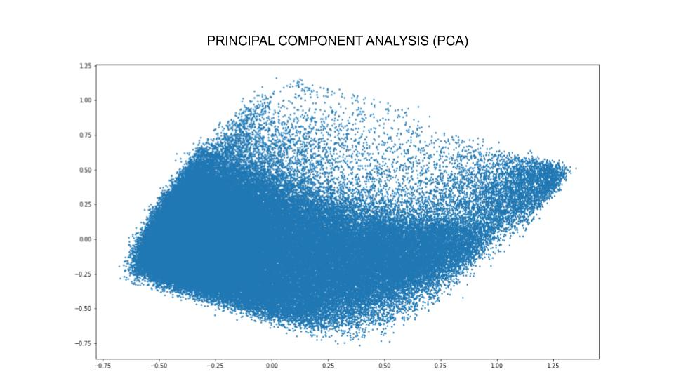
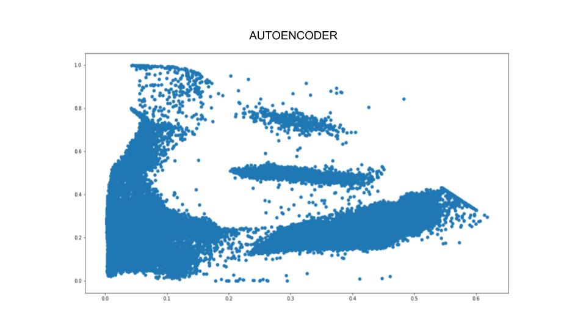
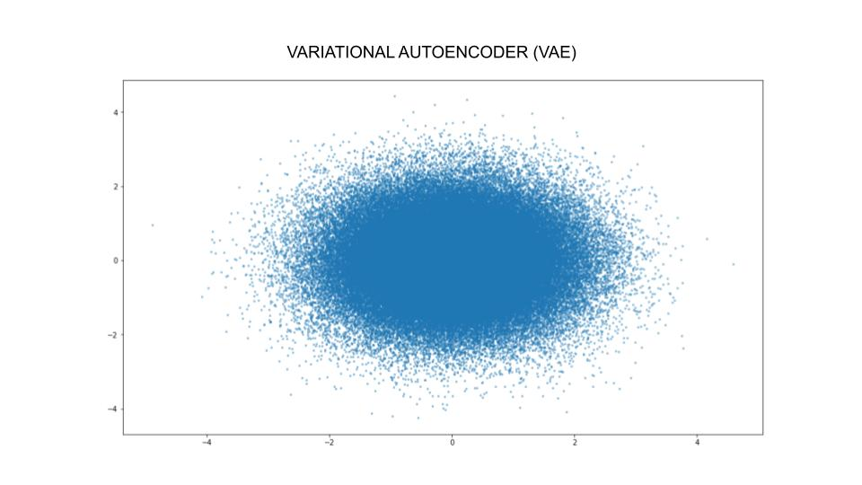
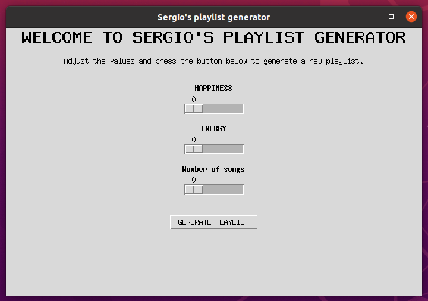
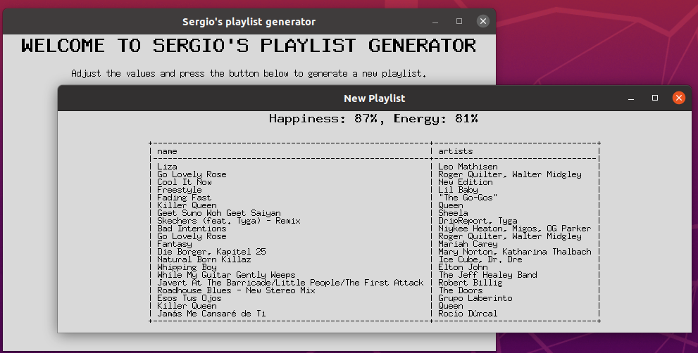

# Spotify Database Playlist Generator
Retro-style GUI to generate playlist from Spofity Database based on your current mood. 
Video [here](https://www.linkedin.com/in/sergio-morant-galvez/).

## VARIATIONAL AUTOENCODER FOR DIMENSIONALITY REDUCTION

The original Spotify database contains many features for each song (speechiness, danceability, energy, acousticness, etc), so I used three methods to reduce all of them to a bidimensional space: PCA, Autoencoder and Variational Autoencoder. 

As you can see below, the results vary with each method. I wanted to try and code a VAE for myself and see the differences with the Autoencoder in the resulting latent space. Also, I wanted a more-or-less-continuous and without-blank-spaces latent space so I could get songs from any part of it

The main use of Variational Autoencoders is to generate new data that's related to the original source.

Here it is used only to reduce dimensionality. (A little bit overkill, I know. Keep in mind that this is just a fun project.)

You can turn an Autoencoder into a Variational Autoencoder with minor changes in the encoder and the loss function, and that is what I did here. I also uploaded this part of the code.

If you want to get a deeper understanding of these generative models I strongly recommend the book "Generative Deep Learning" from David Foster.

   
   
   

## Python Package Requirements

- Tkinter
- Pandas
- Numpy
- Scipy
- Tabulate

## Description

Tkinter-based GUI to generate playlists based on your current mood ("Happiness" and "Energy") from +160.000 Spotify songs.

Please note that the songs are represented in a latent space created by using a VAE (Variational Autoencoder) and the axis representation is open to interpretation. 

This is just a fun project developed to apply some deep learning architectures.

## Usage

### Step 1

Adjust the sliders values according to your current mood and how long you want the playlist to be.

### Step 2

Press the button and generate a new playlist. 
There is some randomness involved on purpose, so you can get different results even if you enter the same values again. 
You won't get the same songs every time!

### Step 3

Enjoy the playlist and I hope you discover some new music!

## Images

